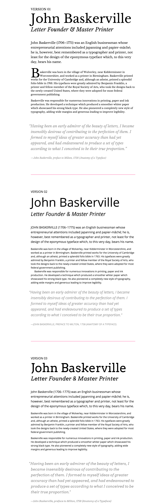

# Baskerville-CSS-exercise
Week 10's task of using CSS to style text in 3 different ways that are shown in the image below;

29th November 
-------------
- [Version 1](https://github.com/AynsleyLongridge/Baskerville-CSS-exercise/blob/master/exercise-1.html)

